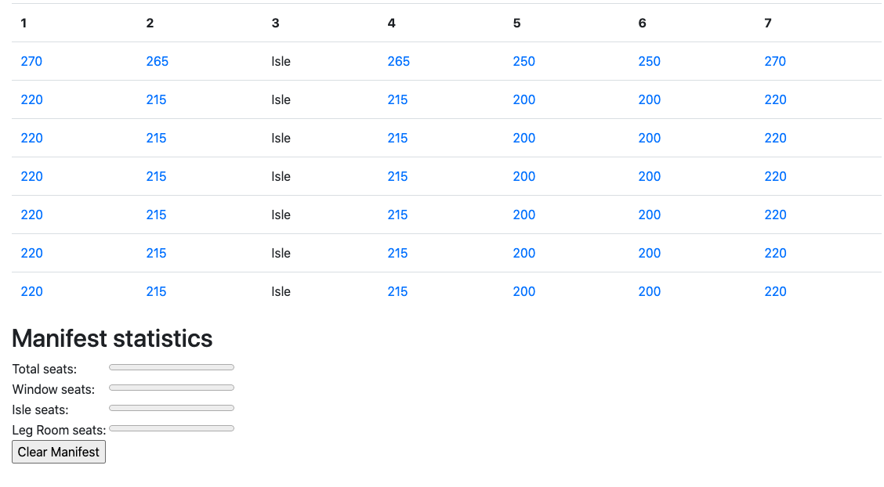
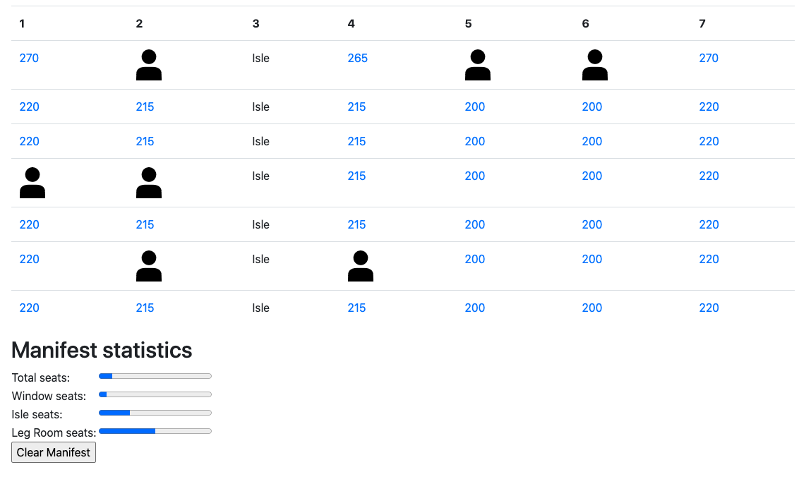

# Seating-arrangement

The program creates the seating arrangement and updates availability using PHP and a textfile.

The starting page clears the manifest, so the user can choose the amount of rows, seats in a row and the position of the isle.

After the data is entered, the program will create the seating arrangement with all the requirements given
For instance, if user enters 7 - 7 - 3, the following layout will be created:

The manifest shows the seats and their prices as well as the statistics on reserved and available seats.

The price depends on the location of the seat. The first row with the leg room adds up $50 to the initial price.The isle seat adds up $15 and thw window one has a \$20 increase.

The user is able to reserve a seat by clicking on the price. Whenever it is done, the text file is updated and the seat it shown as reserved. In addition to that, the statistics shows the up-to-date data, so user can chech what who many seats left/reserved.

