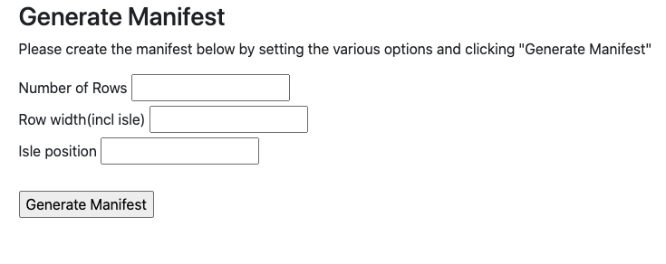

# Seating-arrangement

The program creates the seating arrangement and updates availability using PHP and a textfile.

## **LAUNCH**

Start the server on MAMP(macOS) or WAMP(windows)

**MAMP:**

check the folder used for the server:
MAMP -> Preferences -> Web Server -> choose/check the document root directory.
Place files in this folder

check the used port(mine is 8888):
MAMP -> Preferences -> Ports ->Apache Port

Make sure that the server is on. Then go the the browser and enter `localhost:8888` to see the files in a folder. find `index.php` and click on it to display the program.

**WAMP**

Run the WAMP program.
On the right bottom corber click on the wamp icon.
Apache -> Alias directories -> add alias
enter the alias name (ex. seating) and the directory of the folder with files

go to the browser and enter `localhost/seating`

 

## **DEMO**

The starting page clears the manifest, so the user can choose the amount of rows, seats in a row and the position of the isle.

After the data is entered, the program will create the seating arrangement with all the requirements given
For instance, if user enters 7 - 7 - 3, the following layout will be created:

The manifest shows the seats and their prices as well as the statistics on reserved and available seats.

The price depends on the location of the seat. The first row with the leg room adds up $50 to the initial price.The isle seat adds up $15 and thw window one has a \$20 increase.

The user is able to reserve a seat by clicking on the price. Whenever it is done, the text file is updated and the seat it shown as reserved. In addition to that, the statistics shows the up-to-date data, so user can chech what who many seats left/reserved.

